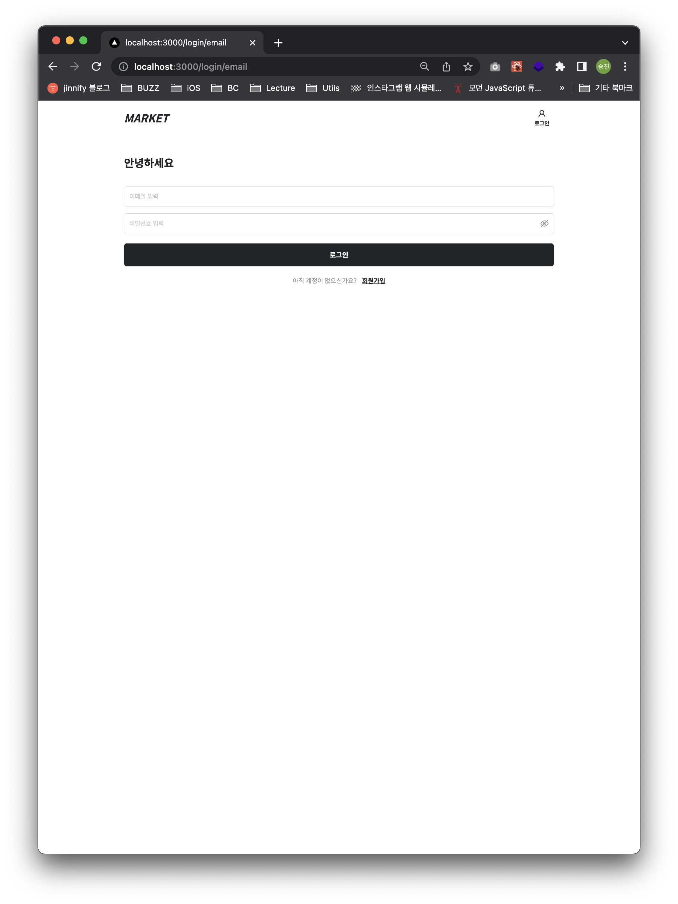
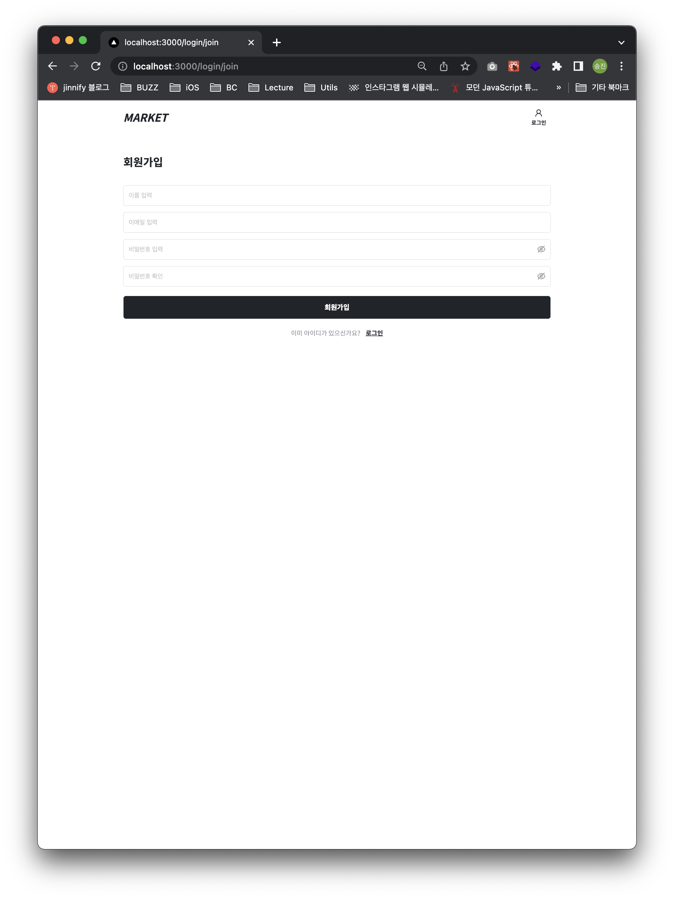
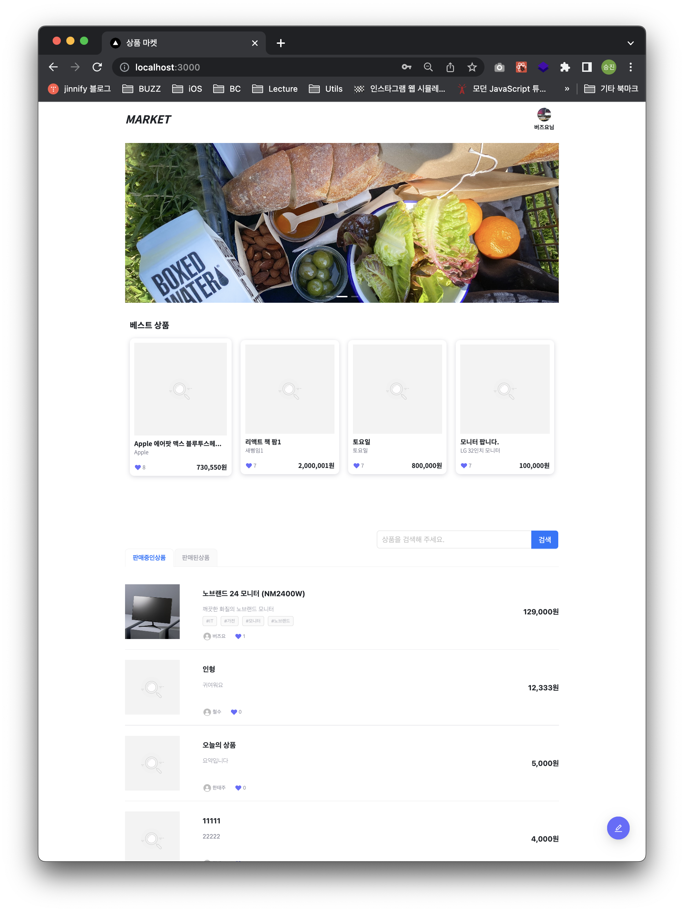
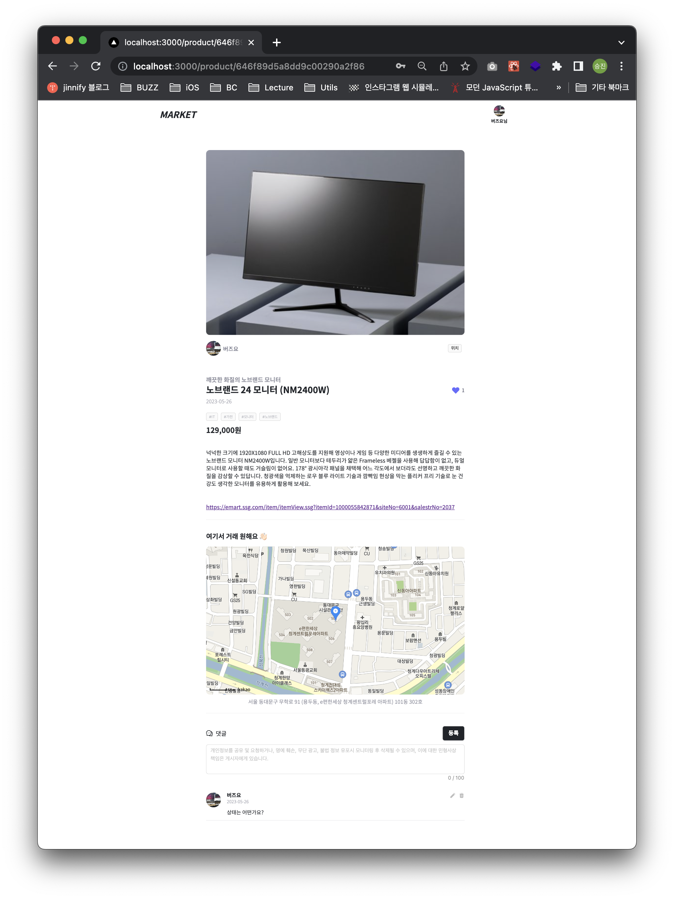
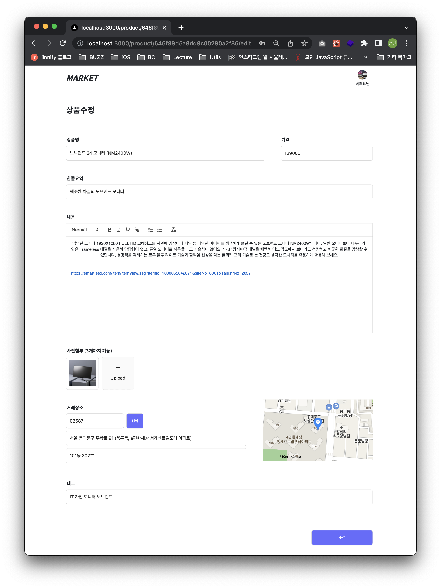
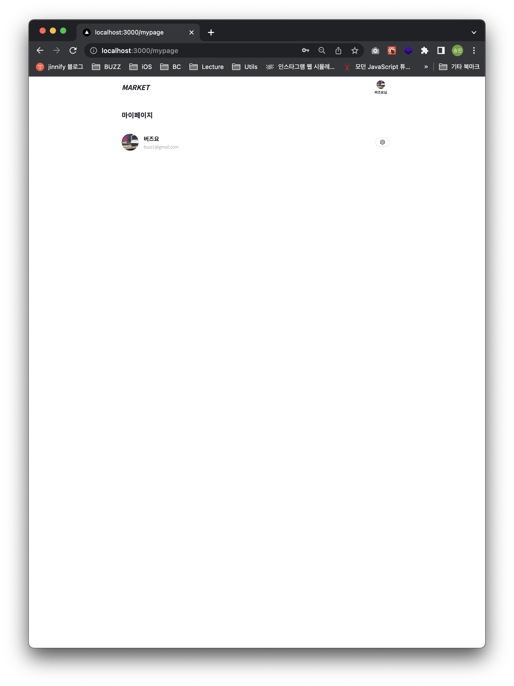
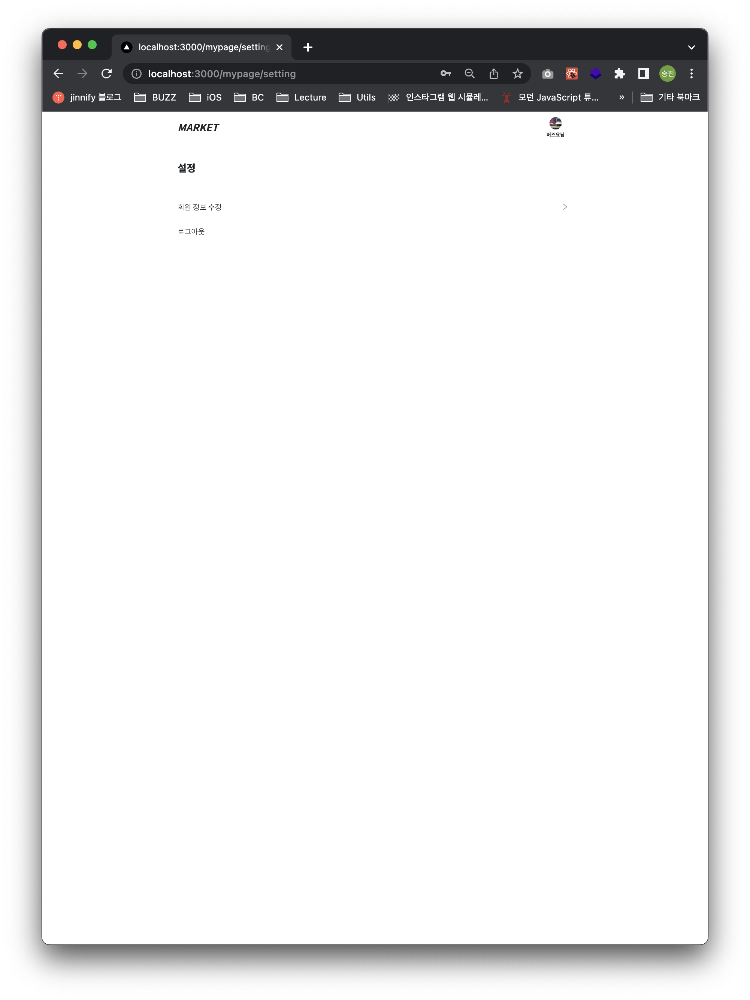
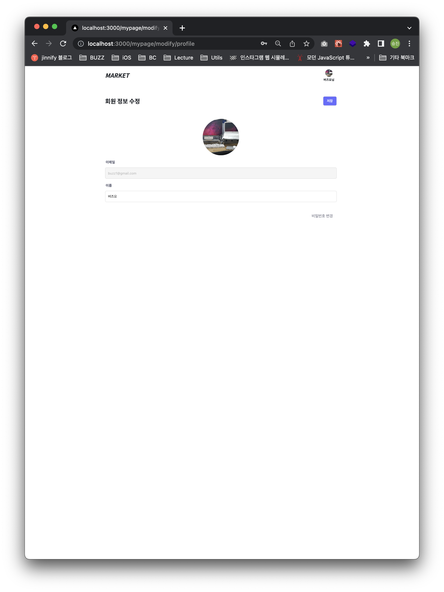

This is a [Next.js](https://nextjs.org/) project bootstrapped with [`create-next-app`](https://github.com/vercel/next.js/tree/canary/packages/create-next-app).

## Getting Started

First, run the development server:

```bash
npm run dev
# or
yarn dev
# or
pnpm dev
```

## 프로젝트

상품 관련 **Public GraphQL API**를 통한 개인 프로젝트 진행

- **기술**
  - Typescript를 이용한 Next.js 프레임워크 사용
  - Container-Presenter Pattern 적용
  - Emotion, Antd 이용한 UI 개발
  - Apollo를 이용한 GraphQL Network 사용
  - Recoil을 이용한 전역 상태 관리
- **설명**
  - Auth
    - 로그인, 회원가입, 로그아웃
      - JWT를 이용한 AccessToken, RefreshToken 처리
    - 유저정보, 유저정보수정
  - Home
    - 상품 리스트, 상품 검색
    - react-infinite-scroller를 통해 무한 스크롤 적용
  - 상품
    - 상품 CRUD
      - 상세 정보
      - 등록시 Daum 우편 주소를 Geocoder를 이용해 KakaoMap 좌표 처리
      - 웹 에디터(react-quill)
        - dompurify를 통해 크로스 사이트 스크립팅(XSS) 공격 대응
      - React-hook-form + yup을 이용한 input 및 에러 처리
      - 좋아요, 댓글 기능
        - OptimisticUI 처리









